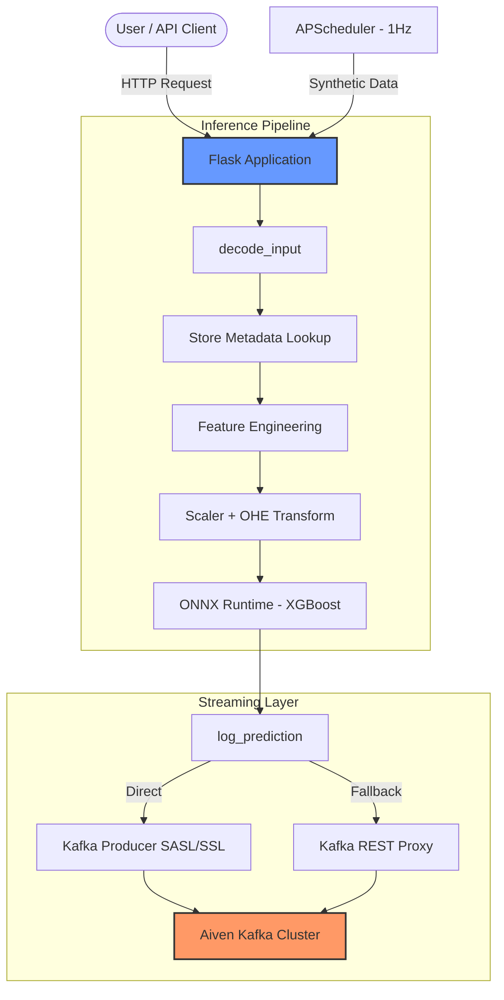

# Rossmann Store Sales Predictor

---

## [Live Demo](https://rossman-deployed-xxk0.onrender.com/)

---

An end-to-end MLOps project — a production-deployed XGBoost model served via Flask, with every prediction (user or synthetic) streamed in real time to a managed Kafka cluster for continuous pipeline observability.

Built to mirror how ML systems work in industry: not just a model, but a live inference service with a streaming data layer.

---

## Tech Stack

| Layer | Technology |
| :--- | :--- |
| **Model & Inference** | XGBoost (ONNX runtime for optimized inference) |
| **Backend** | Python 3.11 · Flask · Gunicorn |
| **Real-time Streaming** | Apache Kafka (Aiven managed) · REST Proxy & SASL/SSL |
| **Data & Feature Eng.** | NumPy · Joblib · Scikit-learn (OHE + StandardScaler) |
| **Monitoring** | Flask-APScheduler (1 Hz synthetic inference loop) |
| **Containerization** | Docker · Render (Cloud Deployment) |

---

## Key Features

- **Optimized Inference**: Converts XGBoost models to **ONNX** format for faster, memory-efficient predictions in resource-constrained environments (like Render's free tier).
- **Hybrid Kafka Integration**: Robust reporting system that prefers direct SASL_SSL/SSL connections but seamlessly falls back to the **Kafka REST Proxy** for maximum portability across cloud environments.
- **Continuous Observability**:
  - **Live Inference Loop**: A background worker (APScheduler) generates 1 prediction per second, simulating real-world traffic.
  - **Real-time Metrics**: View live message counts and partition offsets directly from the `/stats` endpoint.
- **Automatic Feature Engineering**: Dynamically computes time-based features (e.g., `CompetitionOpen`, `IsPromo2Month`) from raw input and static store metadata.

---

## Getting Started

### 1. Environment Setup
Create a `.env` file with your credentials:
```env
KAFKA_BOOTSTRAP_SERVER=your-kafka-server:port
KAFKA_USER=your-username
KAFKA_PASS=your-password
KAFKA_TOPIC=rossman
KAFKA_REST_PROXY_URL=your-rest-proxy-url
```

### 2. Run with Docker
```bash
docker build -t rossman-predictor .
docker run -p 8080:8080 --env-file .env rossman-predictor
```

### 3. Local Development
```bash
pip install -r requirements.txt
python app.py
```

---

## Architecture




---

## Features

- **Sales Prediction** — predict daily revenue for any of 1,115 Rossmann stores
- **Store Metadata Enrichment** — automatically resolves StoreType, Assortment, CompetitionDistance, Promo2 intervals from a prebuilt store dictionary
- **Web UI** — brutalist-styled interface with toggle switches for promo/holiday flags; toast notification confirms Kafka delivery after each prediction
- **REST API** — programmatic access for integration and batch testing
- **Real-time Kafka Pipeline** — full feature vector + prediction published per inference
- **Synthetic Logger** — 1 Hz background job generates realistic store inputs and runs full inference, keeping the Kafka stream alive continuously
- **Cloud-native** — deployed on Render, Kafka hosted on Aiven

---

## Model Details

Trained on the [Rossmann Store Sales](https://www.kaggle.com/c/rossmann-store-sales) Kaggle dataset (~1 million rows, 1,115 stores).

**Numerical features:** Store, Promo, SchoolHoliday, CompetitionDistance, CompetitionOpen, Promo2, Promo2Open, IsPromo2Month, Day, Month, Year, WeekOfYear

**Categorical features (one-hot encoded):** DayOfWeek, StateHoliday, StoreType, Assortment

**Preprocessing:** StandardScaler on numerical features, OneHotEncoder on categoricals — both fitted on training data and serialized alongside the model.

---

## Kafka Message Schema

Every inference produces a message like this on the `rossman` topic:

```json
{
  "timestamp": "2026-04-17T22:49:57.123456",
  "store_id": 1,
  "date": "2015-07-31",
  "promo": 1,
  "state_holiday": "0",
  "school_holiday": 1,
  "prediction": 5263.14,
  "data_source": "user"
}
```

`data_source` is `"user"` for real predictions or `"synthetic"` for scheduler-generated ones.

---

## Reading Kafka Records

Aiven's REST proxy doesn't support the consumer API, so use `kafka-python` directly (requires the SSL certs).

**Check total message count:**
```bash
curl -s -u "$KAFKA_USER:$KAFKA_PASS" \
  "https://kafka-23493bfd-aditya-fbdc.k.aivencloud.com:22768/topics/rossman/partitions/0/offsets"
```

**Read latest 100 records (requires `ca.pem`, `service.cert`, `service.key` in current dir):**
```bash
python - <<'EOF'
import json, os
from kafka import KafkaConsumer, TopicPartition

consumer = KafkaConsumer(
    bootstrap_servers='kafka-23493bfd-aditya-fbdc.k.aivencloud.com:22766',
    security_protocol='SSL', ssl_cafile='ca.pem',
    ssl_certfile='service.cert', ssl_keyfile='service.key',
    value_deserializer=lambda v: json.loads(v.decode()),
    consumer_timeout_ms=5000, enable_auto_commit=False, group_id=None,
)
tp = TopicPartition('rossman', 0)
consumer.assign([tp])
end = consumer.end_offsets([tp])[tp]
consumer.seek(tp, max(0, end - 100))
for msg in consumer:
    print(json.dumps(msg.value, indent=2))
    if msg.offset >= end - 1: break
consumer.close()
EOF
```

---

## REST API

```bash
curl -X POST "https://rossman-deployed-xxk0.onrender.com/api/predictor" \
     -H "Content-Type: application/json" \
     -d '{
           "Store": 1,
           "Date": "2015-07-31",
           "Promo": 1,
           "StateHoliday": "0",
           "SchoolHoliday": 0
         }'
```

**Response:**

```json
{ "prediction": 5263.45 }
```

---

## Local Setup

1. Clone the repo:

   ```bash
   git clone https://github.com/rautaditya2606/Rossman-Deployed.git
   cd Rossman-Deployed
   ```

2. Create a virtual environment and install dependencies:

   ```bash
   python -m venv venv
   source venv/bin/activate       # Windows: venv\Scripts\activate
   pip install -r requirements.txt
   ```

3. Add Kafka credentials. For SSL cert auth (local), place in project root:
   - `ca.pem` — CA certificate
   - `service.cert` — access certificate
   - `service.key` — access key (PKCS#8 format)

4. Create a `.env` file:

   ```env
   KAFKA_BOOTSTRAP_SERVER_SSL=kafka-23493bfd-aditya-fbdc.k.aivencloud.com:22766
   KAFKA_REST_PROXY_URL=https://kafka-23493bfd-aditya-fbdc.k.aivencloud.com:22768
   KAFKA_BOOTSTRAP_SERVER=kafka-23493bfd-aditya-fbdc.k.aivencloud.com:22769
   KAFKA_USER=avnadmin
   KAFKA_PASS=your_kafka_password
   KAFKA_TOPIC=rossman
   ```

5. Run:

   ```bash
   python app.py
   ```

   Navigate to `http://localhost:8080`.

---

## Deployment (Render)

Set these environment variables in Render → Web Service → **Environment**:

| Key | Value |
| :--- | :--- |
| `KAFKA_BOOTSTRAP_SERVER` | `kafka-23493bfd-aditya-fbdc.k.aivencloud.com:22769` |
| `KAFKA_USER` | `avnadmin` |
| `KAFKA_PASS` | your Kafka password |
| `KAFKA_TOPIC` | `rossman` |

Start command (or via `Procfile`):

```bash
gunicorn --workers 1 --preload --bind 0.0.0.0:$PORT app:app
```

---

## Project Structure

```text
deploy_rossman/
├── app.py                     # Flask app, APScheduler (1 Hz synthetic logger)
├── utils.py                   # Feature decoding, Kafka producer (SSL + SASL fallback)
├── generate_synthetic_data.py # Random input generator for synthetic inference
├── requirements.txt
├── Procfile                   # Render start command (single worker + preload)
├── model/
│   ├── xgb_pipeline.joblib    # Trained XGBoost model
│   ├── scaler.joblib          # StandardScaler
│   ├── encoder.joblib         # OneHotEncoder
│   └── store_static_dict.joblib  # Per-store metadata lookup (1,115 stores)
├── static/
├── templates/
│   └── index.html
└── README.md
```

---

## Acknowledgments

- [Rossmann Store Sales](https://www.kaggle.com/c/rossmann-store-sales) — Kaggle dataset
- [XGBoost](https://xgboost.readthedocs.io/) — gradient boosting library
- [Aiven](https://aiven.io/) — managed Kafka
- [Render](https://render.com/) — cloud deployment
